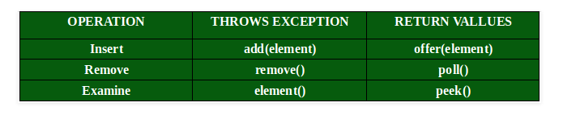
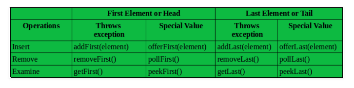

Common API:

Queue:
- LinkedList, ArrayBlockingQueue and PriorityQueue are the most common 	implementations.
- If any null operation is performed on BlockingQueues, NullPointerException is throw.
- BlockQueue have thread-safe implementations
- The Queues which are available in java.util package are Unbounded Queues
- The Queues which are available in Java.util.concurrent package are the Bounded Queues. 

Methods in Queue:
* add() — Add elements at the tail of the queue. 
* peek() — View the head of the queue without removing it, it will return NULL if the queue is empty
* element() — Is similar to peek(), It throw NoSuchElementException when the queue is empty
* remove() — remove and return the head of the queue. It throws exception 
* poll() — remove and return the head of the queue, return null if the queue is empty
* size() — return number of elements.
	

Deque:
- The Deque is related to the double-ended queue that supports add or remove elements from either end of the data structure, it can be used as a queue (FIF)) or as a stack(LIFO). These are faster than Stack and LinedList.
- It provided the support of resizable array and helps in restriction-free capacity, so the grow the array according to the usage.
- Array dequeue prohibit the use of NULL element and do not accept any such element.
- Any concurrent access by multiple threads is not supported
- In the absence of external synchronization, Deque is not thread-sage.

Methods of Deque:
* add(element) : add an element to the tail

* addFirst(element) : Adds an element to the head.

* addLast(element) : Adds an element to the tail.

* offer(element) : Adds an element to the tail and return a boolean to explain if the insertion was successful.

* offerFirst(element) : Adds an element to the head and return a boolean to explain if the insertion was successful.

* offerLast(element) : Adds an element to the tail and returns a boolean to explain if the insertion was successful.

* iterator() : return an iterator for this deque.

* descendingIterator() : return an iterator that has the reverse order for this deque.

* push(element) : Add an element to the head.

* pop(element) : Remove an element from the head and returns it.

* removeFirst() : Removes the element at the head.

* removeLast() : Removes the element at the tail.

* poll() : Retrieves and removes the head of the queue represented by this deque( in other word, the first element of this deque). or returns nulll if this deque is empty.

* pollFirst() : Retrieves and removes the first element of this deque, or returns null if the deque is empty.

* pollLast() : Retrieves and removes the last element of this deque, or returns null if the deque is empty

* peek() : Retrieves, but does not remove, the head of the deque represented by this deque( the first element of this deque), pr return null if this deque is empty.

* **peekFirst():** Retrieves, but does not remove, the first element of this deque, or returns null if this deque is empty.

* **peekLast():** Retrieves, but does not remove, the last element of this deque, or returns null if this deque is empty.

  

PriorityQueue:

- PQ doesn't permit null

- We cannot create PQ of Objects that are non-comparable

- PQ are unbound queues

- The head of this queue is the least element with respect to the speciied ordering, If multiple elements are tied for least value, the head is one of those values ---- ties are broken arbitrarily.

- The queue retrieval operations poll, remove, peek and element access the element at the head of the queue.

- It inherits methods from AbstractQueue, AbstractCollection, Collection and Object class.

  

Constructors Methods:

- **PriorityQueue():** Creates a PriorityQueue with the default initial capacity (11) that orders its elements according to their natural ordering.
- **PriorityQueue(Collection <E> c):** Creates a PriorityQueue containing the elements in the specified collection.
- **PriorityQueue(int initialCapacity)**: Creates a PriorityQueue with the specified initial capacity that orders its elements according to their natural ordering.
- **PriorityQueue(int initialCapacity, Comparator <E>  comparator):** Creates a PriorityQueue with the specified initial capacity that orders its elements according to the specified comparator.
- **PriorityQueue(PriorityQueue <E> c)**: Creates a PriorityQueue containing the elements in the specified priority queue.
- **PriorityQueue(SortedSet<E> c)**: Creates a PriorityQueue containing the elements in the specified sorted set.

Methods: 

- boolean add(E element) : This method inserts the specified element into this priority queue. It will throw an IllegalStateExveption if no space is available.
- offer() : insert the element, but will return false if the element cannot be inserted due to capacity.
- public peek() : This method retrieves, but does not remove, the head of this queue, or returns null if this queue is empty.
- public poll() : This method retrieves and removes the head of this queue, or returns null if this queue is empty.

