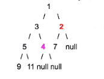

##   Queue:

1. FIFO == first in first out
2. Usages: Breadth-First Search related problems
3. 典型问题：
   1. Tree printout by level
   2. Sliding window problems(Deque: double ends manipulation)

## Stack

LIFO == last in first out: like a  box

Eg: insertion order insertion order 1, 2, 3, 4, then in the stack, it looks like:

​	4

​	3

​	2

​	1 <--- bottom of the stack


 ### Four popular interview questions:

##### Q1: how could we implement a queue by using two stacks

​		stack1:

​		stack2: 

​	Solution1: 

​					stack1: To buffer all new elements

​					stack2:  To pop out 1st element  

​								case1: if stack2 is empty, them we move all element from stack1 to stack2

​								case2: if stack2 is not empty, then we call stack2.pop()

​					Time complexity:

​								Push() ---> O(1)

​								Pop() ---> O(n)

​						Amortized time completity = O(??)


什么问题往stack 考虑？

从左到右linear scan 一个 array/string 时，如果要不断回头看左边最新的元素，往往要用到stack

	1. Histogram 中找最大长方形
 	2. reverse polish notation 逆波兰表达式的计算， a * (b + c)  ----> abc* 
 	3. String de repeatedly deduplication,  cabba -----> can -----> c


##Linkedlist

Key points: 

 1. when you want to de-reference a ListNode, make sure it is not a NULL pointer

    ​	```

    ```java
    ListNode p = new ListNode(0);
    ...p->value
    p.value
    ```

2. Never ever lost the control of the head pointer of the Linkedlist

   for example : when you reverse the linkedlist .


Q1: Reverse a linkedlist, loop and recursive

Q2: Find the middle node of a linkedlist.

Q3: if a linkedlist has a circle

Q4: Insert a node in a sorted linked list

​	Be carefull about two cornor cases: head and tail.


Q5: How to merge two sorted linkedlist into one long sorted linkedlist 

​		DummyNode : when we want to append new elements to an initially empty linkedList, we do not have an initial head node. In this case, we can new a dummy node to act as a head node.


Q6:  N1 --> N2 --> N3 --> N4 --> N5 --> ... --> Nn --> NULL

​		(N1 --> Nn) --> (N2 --> Nn-1) --> ......

Q7: Partition list:

​		Given a linked list and a target value x, partition it such that all nodes less than x are listed before the nodes larger than or equal to target value x.( keep the priginal relative order of the nodes in each of the two partition.)

​		eg: 1 --> 6 --> 3 --> 2 --> 5 --> 2 -->null

​		target: 4

​		result: 1 -->3 -->2a -->2b -->6 -->5

​		Notice that 5 was pointed to 2, but then it is in the end, watch out that there is no circle in the linkedList.


## Binary Tree && Binary Search Tree

Definition: at most two children node.

```java
Class TreeNode {
	int value;
	TreeNode left;
	TreeNode right;
 // TreeNode parent; // point to this node's parent node, not common
}
```

工业界应用：

​	Too many to list all:

​		eg: social network analysis

​			  Information indexing

​			  Information compression

#### tree traverse

​							10

​						/	         \

​					5					15

​				/		\				/	\

​			2			7			12	20

​		/		\

​	null		null

1. Pre-order:

   10	5	2	7	15	12	20

   Implementation with recursion:

   Pre-order: 我把我自己放在最前面来打印/更改value...然后再左， 右

   ```java
   void preOrder(TreeNode root) {
     if(root == null) return; // base case
     System.out.println(root.value);
     preOrder(root.left);
     preOrder(root.right);
   }
   ```

   

2. In-order

   2	5	7	10	12	15	20

   ```java
   void inOrder(TreeNode root) {
     if(root == null) return; // base case
     inOrder(root.left);
     System.out.println(root.value);
     inOrder(root.right);
   }
   ```

   

3. Post-order

   2	7	5	12	20	15	10

   ```java
   void postOrder(TreeNode root) {
     if(root == null) return; // base case
     postOrder(root.left);
     postOrder(root.right);
     System.out.println(root.value);
   }
   ```

   

   **Trick: base case usually refers to the null ChildNode below the leaf node.** 

   

### Balanced binary tree:

Define:  is commonly defined as a binary tree inwhich the depth of the left and right subtrees of every node differ by 1 or less.

​									10

​								  /		\

​								5			15

​							/	\		   / 	 \

​						2		 7

### Complete binary tree:

Define: is a binary tree in which every level, except possibly the last, is completely filled, and all nodes are far left as possible.

​									10

​								  /		\

​								5			15

​							/	\		   / 	 \

​						2		 7  	12		null


### Binary Search Tree:

Define:  for every single node in the tree, the values in its left subtree are all smaller than its value, and the values in its right subtree are all larger than its value.

​										10

​								  /		\

​								5			15

​							/	\		   / 	 \

​						2		 7  	12		20

in order traversal : 2	5	7	10	12	15	20 will form an ascending order.


#### Discussion:

1. Binary tree 往往是最常见的 和 recursion 结合最紧密的面试题目类型

2. Reasons: 

   1. 每层的node 具备的性质， 传递的值和下一层的性质往往一致， 比较容易定义 recursive rule.
   2. Base case(generally): null pointer under the leaf node
   3. Example1: int getHeight(Node root)
   4. Example2: 统计tree里有多少个node

3. Fundamental Knowledge:

   1. Traversal of a binary tree
   2. Definition:
      1. Balanced binary tree
      2. Complete binary tree
      3. Binary search tree(BST) 

   ```java
   // get height of a binary tree
   public int getHeight(TreeNode root) {
     if(root == null) {
       return 0;
     }
     int left = getHeight(root.left);
     int right = getHeight(root.right);
     return 1 + Math.max(left, right);
   }
   // Time = O(n) 走了每一个node
   // Space = O(n) 最坏linkedlist，the height of the tree , call stack
   
   
   ```

Q1: How to determine whether a binary tree is a balanced binaty tree?

```java
//This is not the best way
public boolean isBalanced(TreeNode root) {
  if(root == null) {
    return true;
  }
  int left = getHeight(root.left);
  int right = getHeight(root.right);
  if(Math.abs(left - right) > 1) {
    return false;
  }
  return isBalanced(root.left) && isBalanced(root.right);
}
```

​												root			第一层：O(n/2) + O(n/2) = O(n)

​						/													\

​			isBalanced(root.left) （getHeight 为 n/2 Node）O(n/2) |	isBalanced(root.right) 

​					/ 			\

isBalanced(root.left)	isBalanced(root.right) 

第二层： O(n/4) + O(n/4) + O(n/4) + O(n/4)  = O(n);

一共 log(n) 层： So Time is O(nlogn);


Q2: How to determine whether a binary tree is symmetric?

 														10

​								5													5

​					1				3								3						1

​			2		4		6		8					8		6				4		2


```java
//Helper function
boolean isSymmetric(TreeNode one, TreeNode two) {
  if(one == null && two == null) {
    return true;
  }else if (one == null || two == null) {
    return false;
  }else if(one.value !== two.value) {
    return false;
  }
  
  return isSymmetric(one.left, two.right) && isSymmetric(one.right, two.left);
}
```

Time : 每层比较n/2 为： O(n)

Space: height: O(n)


Q3: Let's assume if we tweak the child with rchild of an arbitrary node in a binary tree, then the structure of the tree are not changed. Then how can we determine whether two binary trees structures are identical?

```java
public boolean isIdentical(TreeNode one, TreeNode two) {
  if(one == null && two == null) {
    return true;
  }else if (one == null || two == null) {
    return false;
  }else if(one.value !== two.value) {
    return false;
  }
  
  return isIdentical(one.left, two.left) && isIdentical(one.right, two.right) 
    || isIdentical(one.left, two.right) && isIdentical(one.right, two.left) 
}
```


​				root 1 n Nodes															root 2 n Nodes

​		/	  					| 															|							\

IIden(LL, RL)			IIden(LR, RR)								IIden(LL, RR)				IIden(LR, RL)

/||\							/||\												/||\									/||\


Time: Thing about the binary:

​			1 2 4 8 .... 

​			1 4 16 64 .....

We only consider the last level node because it is larger than the sum of levels that above the last one,

So the time is O(4 ^ log2_n) == O(2 ^ log2 (n ^ 2)) = O(n^2),

Space: level of the tree so log(n).


**Binary Search Tree Questions:**

Q1: How do we determine a binary tree is a BST?

​												10   == root [-inf, + inf]

​											/			\

​									5[-inf, 10]		15[10, +inf ]

​							/				\					/		\

​						2					7[5, 10]	 12		20

Look at the range of a root,

```java
public Boolean isBSTHelper(TreeNode root, int min, int max) {
  if(root == null) {
    return true;
  }
  if(root.value > max || root.value < min) {
    return false;
  }
  
  return isBSTHelper(root.left, min, root) && isBSTHelper(root.right, root, max);
}
```


Time:  O(n)

Space: O(logn)


Q2: Given two value K1, and K2 (K1 < K2), and a root pointer to BST. Print all keys of tree in range K1 and K2.

​	For BST, if we print out all elements in an in-order sequence, then they satisfy that they are printed in an 	increasing order.

So the basic idea is to print all elements in order and get the range.

```java
public void inOrderRange(TreeNode root, int K1, int K2) {
  if(root == null) {
    return;
  }
  if(root.value > K1) { // 左入口
    inOrderRange (root.left, K1, K2);
  }
  
  if(root.value >= K1 && root.value <= K2) {
    System.out.println(root.value);
  }
  
  if(root.value < K2) { //右入口
    inOrderRange (root.right, K1, K2);
  }
}
```


想一下什么情况才能往左走， 什么情况才能往右走。这道题实际上优化是在寻找左入口 和 右入口，找到之后正常inorder print 即可。


## Heap & Graph Search I

#### Heap or priority queue: 

​											1

​										/		\

​									3				2

​								/ 	  \		    /

​							5			4		7

```markdown
is an unsorted array but have special rules to follow:

性质： 堆的实现通过构造二叉堆（binary heap）， 以下性质

	1： 任意节点小于他的所有后裔， 最小元素在堆的根上（堆序性）
	2: 堆总是一棵完全树。 complete tree
	3: 将根结点最大的堆叫做 MAX HEAP， 根结点最小的堆叫做最小堆 MIN HEAP
	4: index of lChild = index of parent * 2 + 1
	5: index of rChild = index of parent * 2 + 2
	6: unsorted but follow rules above

支持的基本操作
	1. insert: 向堆中插入一个新元素： Time: O(log(n))
  2. update: 将新元素提升使其符合堆的性质： Time O(log(n))  .
  3. get/top: 获取当前堆顶元素， Time O(1)
  4. pop:  删除堆顶元素 Time O(log(n))
  5. heapify: 使一个unsorted array 变成一个堆， Time O(n)

```


Q1: Find the smallest K elements in an unsorted array with size N?

First thinking, we need to analyse the relationship between K ane N. 


**How to make assumptions?** 

1: What is the relationship between k and n?

Solution 1:  sort it and return the first k element. Time : O(nlogn)

Solution 2: 

​		Step1: How to build a min-heap? --> heapify it O(n)

​		Step2: Keep popping out K elements  ----> O(klogn)

​		Total time : O(n + klog(n))

Solution3:

​		Step1: use a max-heap ------O(k)

​			Create  a max-heap that size is the k, then other elements will compare with the top, if the max is 			larger than the elements, then pop it and add element into heap, so the max-heap will maintain the 			size and when all elements are compared, than the max-heap is the result.

​		Step2: iterate from the (k + 1)th to the n-th element, and for the current element X, 

​			case 1: if X < max-heap.top(), max-heap.pop(), and max-heap insert(X);

​			case 2: else, do nothing

​	Total Time: O(k ) + O( (n-k)log(k) )  

```markdown
compare: 
O(n + klog(n))											O(k) + O(n-k)logk

case1:  k <<<<< n eg: k = 20, n = 1000000
	
	O(cn)															n*(log(k))
	
case2: k ~ n eg: k = 1billion n = billion
	O(nlogn)												O(nlogn)
 
Finally, we can see that sulotion2 and solution3 can be coparable, but it is hard to say which one is better 
	
```


Solution 4:

quick partition


##### Graph


<01> <14> <23> <13> <04> 

1. Node/state

2. Edge/action

3. Directed vs undirected graph

4. Representation of the graph

   

Basic we have two ways for representating graph

1: Adjacency Matrix : easy, more space, O(v ^ 2)

2: Adjacency List: Space O(V + E)

​		-- Use a hash table


图里的常用search算法

1. Breadth - First Search (BFS-1)

   

Objective : 离source node 一步先遍历， 然后二步之外的， 一层一层走

Data structure: Queue. 

​				When we expand one node, and then we can generate two children node

BFS 操作的基本过程： How to describe a BFS's actrion during an interview

	1. Definition 1: expand a node ---like visit or print its value
 	2. Definition 2: generate s's neighbor node: reach out to it's neighboring node
 	3. Data Structure: Maintain a FIFO queue, put all generated node in the queue
 	4. Termination condition: do a loop until the queue is empty
 	5. Process

分层打印一个binary tree

```java
public void BFS1(Node root) {
  if (root == null) {
    return;
  }
  Queue<Node> q = new LinkedList<Node>();
  q.offer(root);
  while(!q.empty()) {
    int size = q.size(); // suze - 
    for(int i = 0; i < size; i++) {
      Node n = q.remove();
      if(n.left != null) {
        q.offer(n.left);
      }
      if(n.right != null) {
        q.offer(n.right);
      }
      SYstem.out.println(n.val + ' ');
    }
    System.out.println();
  }
}
```


经典例题2: Bipartite: whether a graph's node can be divided into two group, such that the nodes in each group do not have deirect edges between the nodes that belong to the same group.


​		

​				1 <u>

​			/		\

​	(v)2	 _	   3 (v != u)


Queue = { 2, 3}

expand 2, if one node expanded, then it will not expanded again.

then 2 expand 3, but 2 is in v, then 3 should be in u, but 3 already in v when expand 1


经典例题3: Determine whether a binary tree is a complete binary tree




 Solution: after detecting the first node that misses one child, then check whether all following nodes expanded to see whether they have any node generated (if any ----> return false)


Disucssion: 

1. when should we consider to use BFS1 to solve a class of questions?\

   when we deal with thet tree-related problem and in the meantime we need to address the relationship on the same level.

2. BFS1 is not the right algorithm to find the shortest path in an arbitrary path.


#### Best First Search(BFS-2)

经典算法： Dijkstra's Algorithm

1. Usages: Find the shortest path cost from a single node(source node) to any other nodes in that graph(点到面(== 所有点) 的最短距离算法)。
2. Example problem: 从北京到中国其他主要城市的最短距离是多少
3. Data structure: priority-queue( MIN-HEAP)
4. 解题思路：
   1. initial state(start node)
   2. Node expansion/Generation rule:
   3. Termination condition: 所有点都计算完毕才停止， 也就是p-queue 变空


```
Node : 
BFS1 是先进先出
BFS2 是谁最小谁先弹出来
```

 

​		 Example：


Step 0 (initial state) : No nodes have been expanded, Node (4, 0)

 	1. Pop node (4, 0) out of the p_queue, expand Node(4, 0) generate three successors
      	1. Node(5, 10)
      	2. Node(3, 1)
      	3. Node(6, 1)  // tie-breaking
	2. pop node (6,1) generate nothing p_queue = {Node(5, 10), Node(3, 1)}
	3. Pop node(3, 1), generate node(2, cost == parent cost _ 1) = (2, 2)
    	1. p_queue = { node(5, 10), node(2,2)}
	4. Pop node(2,2) generate what ??
    	1. Re-generate node(5, 10), ----> node(5, 2+1) ----> node(5, 3)
    	2. generate node(1, 3)
	5. .....
	6. until the q_queue is empty, then we terminate

Properties:

	1. one node can be expanded once and only once.
 	2. one node can be generated more than once, (cost can be reduced over time)
 	3. all the cost of the nodes that are expanded are monotonically non-decreasing (所有从 priority queue 里面pop 出来的元素值单调非递减 ===》 单调递增)
 	4. time complexity, for a graph with n node and the connectivity of the node is O(nlogn)
 	5. when a node is popped out for expansion, its value is fixed which is equal to the shortest distance from the start node.  

经典例题： 

Given a matrix of size N * N, and for each row the elements are sorted in an ascending order. and for each column the elements are also sorted in an ascending order. how to find the k-th smallest element in it?


1 2 3 4 5

2 3 4 5 6 

3 4 5 6 7 

4 5 6 7 8 

5 6 7 8 9


#### Graph Search Algorithms (DFS)

Back-tracking is just a behavior.

First, let's recall the pre-order traverse the binary tree code


```java
public void printTreePreOrder(Node root) { //DFS behavior
  if (root == null) {
    return;
  }
  System.out.println(root.val);
  printTreePreOrder(root.left);
	printTreePreOrder(root.right); 
}
```

DFS can be implemented by using iterative way or recursive way

But DFS recursive way easier


 DFS 基本方法：

	1. what does it store on each level?(每层代表什么意义， 一般讲解题之前要清楚DFS要recurse 多少层)
 	2. How many different states should we try to put on this level(每层有多少个状态/case 需要try)

经典例题：

​	1 Print all subsets of a set S = { 'a', 'b', 'c'}


​		Here 基本方法：

			1. For each level, it makes the decision on whether to put this element into the final set or not. n 				elements -----> n layers
   			2. Two states or cases, considers either select or not

```java
void FindSubSet(String input, int index, String solution) {
  if (index == input.length) {
    if (solution.size() == 0) {
      System.out.println('empty')
    }
    else{
      System.out.pringln(solution)
    }
    return;
  }
  //case 1, add string at index to subset
  solution.push(back(input.at(index)));
  FindSubSet(input, index + 1, solution);
  solution.pop_back();
  //case 2, add nothing
  FindSubSet(input, index + 1, sulution);
}
```


例题2:

（）（）（）Find all valid permutation using the parenthesis provided

```java
// n stores total number of 'pair of ()' need to add. So total levels == 2*n
// l stores the number of left parenthesis '(' added so far
// r stores the number of right patenthesis ')' added so far
// solu_prefix : solution so far
void DFS(int n, int l, int r, String solu_prefix) {
  
}
```


例题3:
Print all combinations of coins that can sum up to total value k

Eg: k = 99 cents

Coin = [25, 10 5, 1] cent

```java

```


例题4:

Given a string with no duplicated letters, how to print out all permutations of string

Eg: abc


#### HashTable && String I

###### 	hash_table(general item)

​			-- hash_set is a set that only contains keys

​			-- hash table is a <key, value> pair


Q1: For a composition with different kinds of words, try to find the top k frequent words from the composition.

```java
// HashTable ++ prioirty queue
// Step1: Iterate over all the composition and count the frequency of each word by using a hashtable with <key: string, value: int counter>
//Step2: Use a Max-heap
//Or		min-heap
```


Q2: If there is only one missing number from 1 to n in an unsorted array, how to find it in O(n) time, size of array is n - 1.

```java
//Step1: use a hashset to store all elements
//Step2: iterate over all element from 1 to n and check against set
//Time: O(n) Space: O(n)

//XOR bit operation
```


Q3: Find the common number between two sorted array a[M], b[N].

```java
//Binary search
//Step1: For each element in shorter array, we run a binary search in longer array
//Time: O(mlog(n))

//Hash
//Step1: hash_table to store all elements from shorter array
//Step2: for each element in longer array we check if it against
//Time: O(m + n) Space: O(min(m, n))

//Two pointer
```


​		

#### String I

5类常考问题：

1. Removal
   1. Remove some particular charsform a string
   2. remove all leading/trailing /duplicated empty space from a string
2. De-duplication     aaaabbb_cc -------> ab_c
3. Replace empty space " " with "20%"
4. Reversal(swap)           eg: I love yahoo  ------> yahoo love I
5. Substring    --- strstr


Advanced:

1. Move letter around -----> eg: ABCD1234 ------> A1B2C3D4
2. Permutation (use DFS)
3. Decodeing / encoding        aaaabcc -----> a4b1c2
4. Longest substring that contains only unique chars
5. Matching(* ?)
6. Etc


Q1.1: Char removal

Remove a /some particular chars from a string. 

Eg: input : 'student' 

remove 'u' and 'n' then output: 'stdet'

```c++
//This is a bad example
void RemoveChar(string& input) {
  for (int i = 0; i < input.size(); i++) {
    if (input.at(i) == 'u' || input.ar(i) == 'n') {
      input.erase(input.beegin() + i); // here is a O(n) operation
    }
  }
}

// This code has a problem, thinking 'stduuennt'
```

We can use two pointers to do this, think about quick sort, 

两个挡板

```java
// slow pointer, all letters that not u or n (results to return) should be put to the left handside of i
// fast pointer, use to go through input

/*
	Initialization(2个挡板，3区域， 同向而行)
	i = 0, all letters to the left-hand side of i (not including i) are all processed letters that should not be removed(slow)
	
	j = 0, j is the current index to move(fast). all letters in [i, j] are all area that we do not care(empty space xxx)
	
	(j, size - 1]  unknown area to explore.
*/

//This make O(n^2)  to O(n)
```


Q1.2 Remove all leading/trailing and duplicate empty spaces(only leave one empty space if duplicated spaces happen) from the input string.

Eg: 

input : '_ _ _ _ _ abc_ _ _ed_ _ ef_ _'

Output: 'abc_ed_ef'


#### String II

Q4: String reversal

​		apple -----> elppa

```
4.1
Method 1:用两个pointers 即可
i ---->       <----j

4.2
Method 2: recursion
Base Case: when there are 1 or 0 letter remaining, (i >= j)
Recurse rule: reverse(i + 1, j -1)
			-------
		a | ppl |e

void reverse(String input, int left, int right) {
	if(left >= right) {
		return;
	}
	swap(input, left, right);
	reverse(input, left + 1, right -1);
}
```


4.3: I love yahoo  ---> yahoo love I.

Primitive way: Stack || I love yahoo.  ------> pop ----> yahoo love I

way2:

​	1: reverse each word

​	2: reverse each word

用 i j 以space 为界， reverse

i evol oohay

yahoo love i


4.4 abcdef -----> efabcd   shift the whole string to the right-hand side by two positions

​	   abcd || ef (then look at 4.3)

Time : O(n)


Discussion: 

1. The idea for "I love yahoo" can be combined to from more complex problem.

   eg: if we have empty/ leading/ trailing spaces in the input

2. The idea can be extended to other problems as well

   a: 

   eg: String(array) shifing by x chars to the right:

   ​	'abcdef' shift to the left by two steps  -----> 'cdefab'

   ​	Step1:  两个区间各自reverse： ab cdef  ----> ba ----> fedc

   ​	Step2: 整个word reverse ： abfedc -------> cdef ab


#### 5 char Replacement:

eg: 'student' -------> 'stuXXt'(den ----> XX)

Two pointers:

​		slow: all letters to the left hand side of slow are the results to return

​		fast: fast index to scan the whole string


Eg: " www.yahoo.com/?q=flower_market#flower_store"

S1: '_''

S2:"20%" (this time is longer than _)

**Scan from right to left**

Step1: scan the input from left to right to find all occurrences of s1, (eg has two)

Step2: pre-caculate the new size=n + 2(s2.size() - s1.size())

​			extend the length of the input by new size

Step3: use two pointers

​	slow: 放到extended 的最后

​	fast: 放到最后一个字符

<u>all the letters to the right hand side of slow are the final result to return</u>


Conclusion: 

Case1: if s1.length >= s2.length

​	step1: find every single occurrence of s1 in the original string and just replace s1 with s3 until we are done

case 2: if s1.length < s2.length

​	How many extra spaces should we get

Step1: count how many times s1 show up in the original string, eg twice

Step2: 2 * (s2.size -s1.size)

then see the method above


Advanced Topic:

1. Shuffling : Eg: ABCD1234. ---> A1B2C3D4
2. Permutation
3. 


​	


#### Recursion II

What is recursion ?

 1. funtion recall itself

 2. Boil down a big problem to smaller ones(size n depends on size n -1, or n-2 or ....n/2)

 3. Implementation:

    a. Base case: smallest problem to slove

    b. Recursive rule: how to make the problem smaller (if we can resolve the same problem but with a smaller size, then what is left to do for the current problem size n)


##### 1 Recursion 与计算结合

 Q1: 计算 a ^ b

```java
public long pwoer(int a, int b) {
  if(a == 0) {
    return 0;
  }
  if(b == 0) {
    return 1;
  }
  
  return power(a, b-1);
}
```


